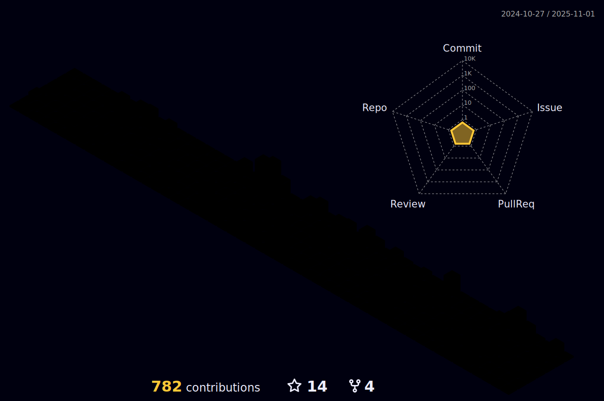

<h1 align="center">Hi 👋, I'm Karthik Alakunta</h1>
<h3 align="center">A Passionate & Enthusiastic Full Stack Web Developer.</h3>

  

  

- 💬 Ask me about **HTML ,CSS , JavaScript, React, tailwindcss, Chakra-ui, Redux, Node JS,  Express JS, MongoDB, Data Structure and Algorithm**

- 📫 How to reach me **karthikalakunta21@gmail.com**
- My <a href="https://drive.google.com/file/d/1T91PahLaInuTS6za3OwvctY__6ZZ1W9h/view?usp=sharing"  target="blank">Resume</a>
<h3 align="left">Connect with me:</h3>

<h3 align="left">Languages and Tools:</h3>

   
  
   
  
   
  
  
  
    
  
 

 

  
  
  
  
  
  

<h2>:clipboard: Github Stats</h2>

  
  

  
   

